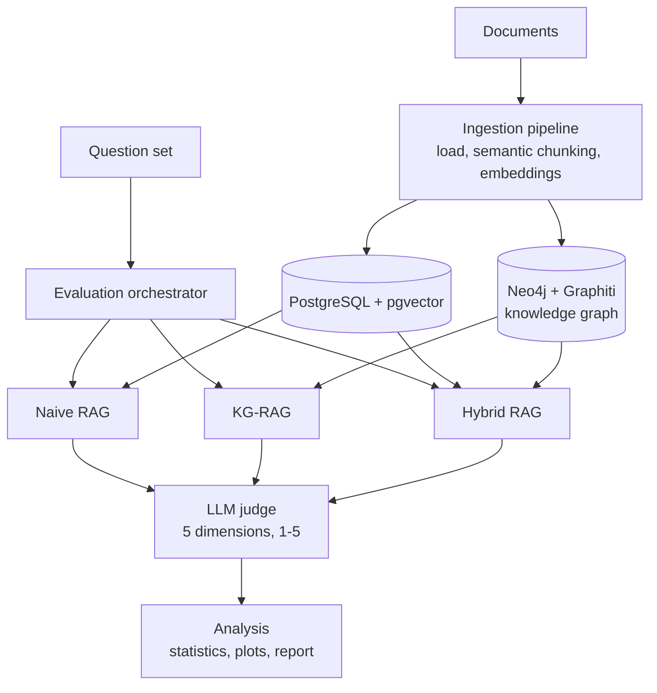

# Naive RAG vs. Knowledge-Graph RAG

[](https://github.com/possenalain/naive-rag-kg-rag/actions/workflows/ci.yml)


[](#license)

A reproducible benchmarking harness that answers one practical question: **for multi-hop question answering, is a knowledge graph worth the extra complexity over plain vector search?**

Three retrieval strategies are implemented behind a common interface, run against the same document corpus and the same question set, and scored by an LLM judge on five quality dimensions plus latency.

| Variant | Retrieval | Stack |
|---|---|---|
| **Naive RAG** | Query → embedding → vector similarity search | PostgreSQL + pgvector |
| **KG-RAG** | Query → entity extraction → graph traversal | Neo4j + Graphiti |
| **Hybrid RAG** | Both retrievers in parallel, results fused | PostgreSQL + Neo4j |

## Results

Benchmark: `big_tech_curated` — 255 questions written over 21 documents about the AI industry (90 factual, 140 multi-hop, 25 analytical). Every answer is scored 1–5 by an LLM judge on each dimension.

| Method | Overall | Correctness | Completeness | Relevance | Faithfulness | Clarity | Avg. latency |
|---|---|---|---|---|---|---|---|
| **Hybrid RAG** | **4.81** | **4.81** | **4.48** | **4.99** | 4.86 | 4.94 | 2.17 s |
| Naive RAG | 4.71 | 4.53 | 4.19 | 4.96 | **4.92** | 4.94 | 1.91 s |
| KG-RAG | 4.38 | 4.11 | 3.78 | 4.53 | 4.56 | 4.91 | 1.89 s |

What the numbers say:

- Fusing both retrievers gives the best answers, mostly through better **correctness and completeness** (+0.3 to +0.7 over the single-retriever variants) for about +0.25 s of latency.
- In this setup, the graph-only retriever did **not** beat plain vector search, and its scores varied more from question to question (overall std 0.91 vs. 0.38 for Hybrid).
- Faithfulness and clarity are essentially tied across methods.

These are single-run, LLM-judged scores on one corpus, so treat them as a comparison of strategies under one configuration, not as a general ranking. The raw per-question outputs and the generated report are in [`benchmarks/runs/big_tech_curated_results_J12V1/`](benchmarks/runs/big_tech_curated_results_J12V1/).

## Architecture



- **Ingestion** (`src/ingestion/`): document loading, semantic chunking, embedding service, and a pipeline that populates both stores.
- **RAG variants** (`src/rag_variants/`): `naive_rag.py`, `kg_rag.py`, `hybrid_rag.py`, all queried the same way.
- **Evaluation** (`src/evaluation/`): orchestrator that runs every question through every variant, and `llm_scorer.py`, the LLM judge (correctness, completeness, relevance, faithfulness, clarity).
- **Analysis** (`src/analysis/`): metrics, statistics and visualisations, plus a text report per run.
- **Agent** (`src/agent/`): a LangGraph-based interactive agent on top of the retrievers.
- **Infrastructure**: Docker Compose for PostgreSQL and Neo4j, multi-stage production and dev Dockerfiles, a Makefile, and a GitHub Actions workflow.

## Quick start

### Prerequisites

Python 3.11+, [uv](https://docs.astral.sh/uv/) (recommended) or pip, Docker with Docker Compose, and about 8 GB of RAM.

### 1. Install

```bash
# with uv (recommended)
curl -LsSf https://astral.sh/uv/install.sh | sh
uv venv && source .venv/bin/activate
uv sync --all-extras

# or with pip
python -m venv venv && source venv/bin/activate
pip install -r requirements.txt
```

### 2. Configure

```bash
cp .env.example .env
# edit .env: database credentials and your LLM / embedding provider key
```

Gemini is the default provider; a local Ollama model also works:

```bash
# Gemini (default)
LLM_PROVIDER=gemini
LLM_MODEL_NAME=gemini-1.5-pro
LLM_API_KEY=your_key

# Ollama (local)
LLM_PROVIDER=ollama
LLM_BASE_URL=http://localhost:11434
LLM_MODEL_NAME=llama3.1
```

### 3. Start the databases and initialise them

```bash
docker-compose up -d
uv run python -m src.utils.db init
uv run python -m src.utils.graph init
uv run python setup.py        # verifies the setup
```

### 4. Ingest, evaluate, analyse

```bash
uv run python cli.py ingest ./data/big_tech_docs
uv run python cli.py evaluate --num-questions 50 --dataset big_tech_curated --output-dir ./benchmarks/runs/my_run
uv run python cli.py analyze ./benchmarks/runs/my_run/eval_*.json --output-dir ./benchmarks/runs/my_run
```

Use `--num-questions -1` to run the full question set, and `uv run python cli.py --help` for all commands.

> **Note on data:** the 21 source documents of the `big_tech_curated` benchmark (`data/big_tech_docs/`) are not included in this repository. The question sets are in [`benchmarks/datasets/`](benchmarks/datasets/) and the results above come from them; to re-run the benchmark, or to evaluate on your own material, point `cli.py ingest` at a folder of markdown documents.

## Project structure

```
naive-rag-kg-rag/
├── cli.py               # command-line interface: ingest / evaluate / analyze / reset
├── setup.py             # setup verification
├── config/              # settings
├── src/
│   ├── ingestion/       # loading, chunking, embeddings, pipeline
│   ├── rag_variants/    # naive, knowledge-graph and hybrid RAG
│   ├── evaluation/      # orchestrator and LLM judge
│   ├── analysis/        # metrics and visualisations
│   ├── agent/           # LangGraph agent
│   └── utils/           # database and graph helpers
├── benchmarks/
│   ├── datasets/        # question sets (JSON)
│   └── runs/            # evaluation outputs and reports
├── db/  sql/  graph-queries/   # schema and query helpers
├── docs/                # architecture, quick start, Docker guide, report (PDF)
├── docker-compose.yml   # PostgreSQL + Neo4j
├── Dockerfile / Dockerfile.dev
└── Makefile
```

Helper targets: `make setup`, `make format`, `make lint`, `make docker-up`, `make docker-build`.

## Documentation

- [`docs/QUICKSTART.md`](docs/QUICKSTART.md)
- [`docs/ARCHITECTURE.md`](docs/ARCHITECTURE.md)
- [`docs/PROJECT_OVERVIEW.md`](docs/PROJECT_OVERVIEW.md)
- [`docs/DOCKER_GUIDE.md`](docs/DOCKER_GUIDE.md)
- [`docs/NAIVE-RAG-KG-RAG.pdf`](docs/NAIVE-RAG-KG-RAG.pdf) — written report

## Limitations and next steps

- Scores come from an LLM judge in a single run; repeated runs and a second judge model would tighten the comparison.
- The `tests/` package is a placeholder. Unit tests for the three retrieval variants and the scorer are the next thing to add; CI currently covers formatting, linting and building both Docker images.
- Results are for one corpus (AI-industry news and analysis). Behaviour on other domains may differ.

## Troubleshooting

```bash
docker-compose ps            # service status
docker-compose logs -f       # service logs
uv run python setup.py       # re-run setup checks
```

## License

MIT

## Acknowledgments

Built with [Pydantic AI](https://ai.pydantic.dev/) and [Graphiti](https://github.com/getzep/graphiti). Inspired by Cole Medin's Agentic RAG work.
